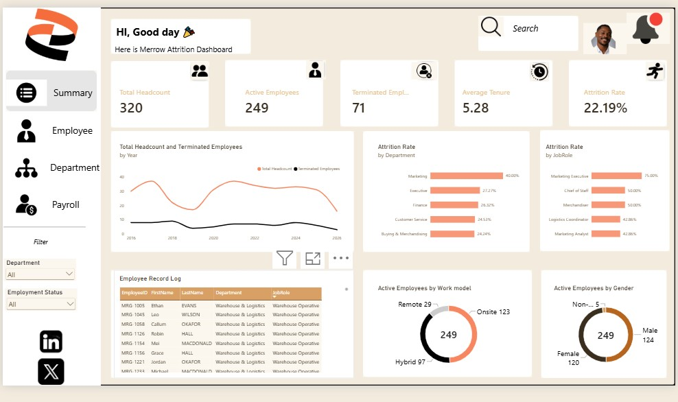

# Merrow Retail: HR Attrition Analytics with Microsoft Fabric and Power BI

An end-to-end people analytics project: raw HR data in Excel, loaded through a Microsoft Fabric pipeline into a Lakehouse and Warehouse, and turned into an interactive Power BI attrition dashboard.

## Demo Video

## Dashboard

## Architecture
Excel HR dataset → Fabric Data Pipeline (Copy job) → Lakehouse → Warehouse → Power BI report

## Key Insights
- Overall attrition rate of 22.19%, with 71 of 320 employees terminated
- Marketing had the highest department attrition at 40%
- Marketing Executive was the most affected role, at 75% attrition
- Average tenure was 5.28 years

## Dashboard Pages
Summary, Employee, Department, and Payroll, with filters for department and employment status.

## Tools
Microsoft Fabric (Data Pipeline, Lakehouse, Warehouse), Power BI, DAX, Excel

## Author
Adedeji Oluwasegun John | [LinkedIn](https://linkedin.com/in/oluwasegunadedeji)
